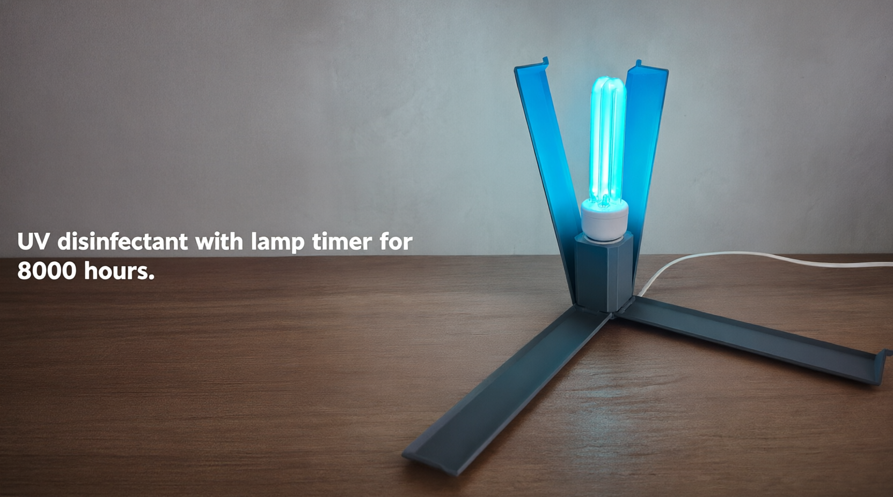

# Ultraviolet Disinfection Lamp

A compact ultraviolet disinfection lamp project built around an E27 UV lamp, an ESP32-C3, an OLED display, and a runtime counter.

## Project Overview

This project combines:

- an E27 ultraviolet lamp
- an ESP32-C3 microcontroller
- an OLED display
- a runtime counter for disinfection sessions

## Project Links

- Project build videos: https://www.youtube.com/@t_kaper
- Project description: https://t-kaper.github.io/posts/uv-disinfection-lamp/

## 3D Models

- STL files: [`3D_Models/stl`](3D_Models/stl)
- SolidWorks assembly: [`lampa.SLDASM`](3D_Models/lampa.SLDASM)

## Documentation

- [`docs/CAD_GIT_GUIDE.md`](docs/CAD_GIT_GUIDE.MD)
- [`docs/FIRMWARE_GUIDE.md`](docs/FIRMWARE_GUIDE.MD)

## ESP32-C3 Firmware

Common PlatformIO commands:

```bash
pio device list
pio run
pio run -t upload
pio device monitor --port /dev/cu.usbmodem2101 -b 115200 --rts 0 --dtr 0
```

For more details, see [`docs/FIRMWARE_GUIDE.md`](docs/FIRMWARE_GUIDE.MD).


